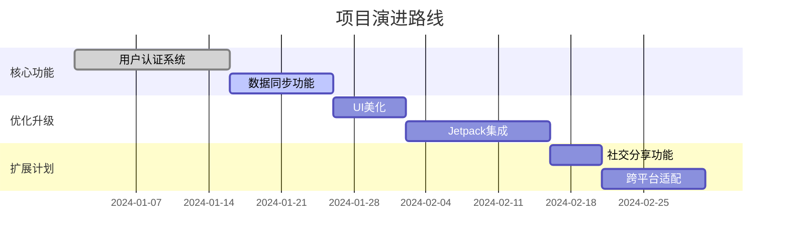

# 🚀 Head First Android 实践项目 

<div align="center">
  
  
  
</div>

<p align="center">
  
</p>

## 📖 项目简介
基于《Head First Android 开发》的学习实践项目，通过5个精心设计的应用模块，带你从零掌握Android开发精髓！

> 🌟 **学习轨迹**：My First App → ToDo列表 → 天气应用 → 计算器 → 音乐播放器

## 🎯 功能亮点

### 📱 应用矩阵
| 应用模块       | 🛠️ 核心技术               | 🎨 特色功能                 |
|----------------|--------------------------|---------------------------|
| **My First App**| `Activity` `TextView`    | 初探Android生命周期       |
| **ToDo List**  | `RecyclerView` `SQLite`  | 数据持久化与列表交互       |
| **天气助手**    | `Retrofit` `JSON`        | 实时API数据获取           |
| **科学计算器**  | `事件处理` `表达式解析`    | 四则运算与异常处理         |
| **音乐盒子**    | `MediaPlayer` `Service`  | 后台播放与音频控制         |

## 🧰 技术栈全景

<div align="center">
  
  
  
  
</div>

```kotlin
// 示例代码：Retrofit网络请求
interface WeatherService {
    @GET("weather")
    suspend fun getWeather(
        @Query("city") city: String,
        @Query("key") apiKey: String
    ): Response<WeatherData>
}
```

## 🛠️ 项目结构

```bash
📦 HeadFirstAndroid
┣ 📂 app
┃ ┣ 📂 src
┃ ┃ ┣ 📂 main
┃ ┃ ┃ ┣ 📂 java      # 核心逻辑代码 🧠
┃ ┃ ┃ ┣ 📂 res       # 资源宝库 🎨
┃ ┃ ┃ ┃ ┣ 📂 layout  # UI蓝图 🖼️
┃ ┃ ┃ ┃ ┣ 📂 drawable # 图形资源 🖌️
┃ ┃ ┃ ┃ ┗ 📂 values  # 字符串/颜色 🌈
┃ ┃ ┃ ┗ 📜 AndroidManifest.xml # 应用身份证 🆔
┣ 📜 build.gradle    # 构建配置 ⚙️
┗ 📜 README.md       # 项目宝典 📚
```

## 🚀 快速启动

### 准备工作
- Android Studio Flamingo 2022.2.1+
- Android SDK 33+
- Java 17+

### 运行指南
```bash
# 1. 克隆仓库
git clone https://github.com/yourname/HeadFirstAndroid.git

# 2. 导入Android Studio
File → Open → 选择项目目录

# 3. 构建项目
Build → Make Project (Ctrl+F9)

# 4. 运行模拟器
Tools → Device Manager → 创建虚拟设备

# 5. 启动应用
Run → Run 'app' (Shift+F10)
```

## 🌱 学习收获

<div align="center">
  


</div>

- 🧬 **生命周期管理**：掌握Activity/Fragment的生命周期
- 🎨 **UI设计**：精通ConstraintLayout布局技巧
- 💾 **数据存储**：SharedPreferences与SQLite实战
- 🌐 **网络编程**：Retrofit+RxJava最佳实践
- 🎵 **多媒体处理**：后台Service音频播放
- 🧵 **多线程**：协程与Handler消息机制

## 🚧 开发路线图



## 🤝 参与贡献

欢迎加入我们的开发者社区！🎉

1. **Fork** 本仓库
2. 创建新分支 (`git checkout -b feature/AmazingFeature`)
3. 提交修改 (`git commit -m 'Add some AmazingFeature'`)
4. 推送分支 (`git push origin feature/AmazingFeature`)
5. 发起**Pull Request**

## 📜 开源协议

[](https://opensource.org/licenses/MIT)

## 📬 联系作者

<a href="mailto:nancychen666666@gmail.com">
  
</a>
<a href="https://github.com/naixinchen">
  
</a>

---
<!-- 动态分隔线 -->
<p align="center">
  
</p>

<div align="center">
  Made with ❤️ by [NaixinChen] | 
  Special thanks to《Head First Android》📚
</div>

