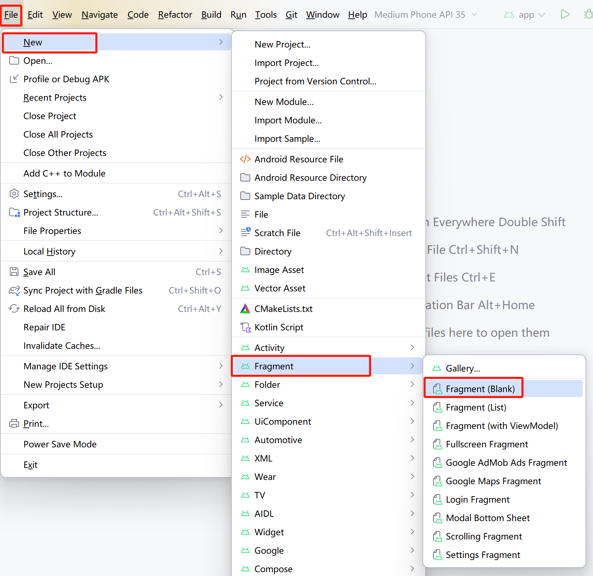

# Fragment介绍
Fragment是一种可以嵌入在 Activity 当中的 UI 片段
## Fragment的创建
通过File菜单，然后选择"File"——>"New" ——> "Fragment" ——> "Fragment(Blank)"

指定Frgment Name、Fragment Layout Name和Source Language，点击"Finish"完成Fragment的创建


## Fragment的文件解析
### 控制Fragment行为的Kotlin文件
在项目/app/src/main/java/com.example.项目名/BlankFragment.kt有如下代码：
```kotlin
class BlankFragment : Fragment() {
    override fun onCreateView(
        inflater: LayoutInflater, container: ViewGroup?,
        savedInstanceState: Bundle?
    ): View? {
        // Inflate the layout for this fragment
        return inflater.inflate(R.layout.fragment_blank, container, false)
    }
}

```
在代码中，BlankFragment扩展了Fragment，使BlankFragment从一个普通的类变成了一个真正的Fragment，在这个类中覆盖了onCreactView()，Android需要显示这个Fragment的UI时，会调用onCreactView()方法:</p>
<p>第一个参数是一个LayoutIflater，用于膨胀Fragment的布局，将XML布局文件转换为视图对象；</p>
<p>第二个参数是一个ViewGroup，代表了Fragment的父视图，用于指定Fragment视图的布局参数，并将Fragment的视图添加到这个容器中；</p>
<p>第三个参数是一个Bundle，用于保存 Fragment 的状态.</p>
<p>这个方法返回一个View</p>

### 描述Fragment外观的XML布局文件
在项目/app/src/main/res/layout/fragment_blank.xmlres/layout/fragment_blank.xml中有如下代码，显示了Fragmment外观布局：

```xml
<?xml version="1.0" encoding="utf-8"?>
<FrameLayout xmlns:android="http://schemas.android.com/apk/res/android"
    xmlns:tools="http://schemas.android.com/tools"
    android:layout_width="match_parent"
    android:layout_height="match_parent"
    tools:context=".BlankFragment">

    <!-- TODO: Update blank fragment layout -->
    <TextView
        android:layout_width="match_parent"
        android:layout_height="match_parent"
        android:text="@string/hello_blank_fragment" />

</FrameLayout>
```
